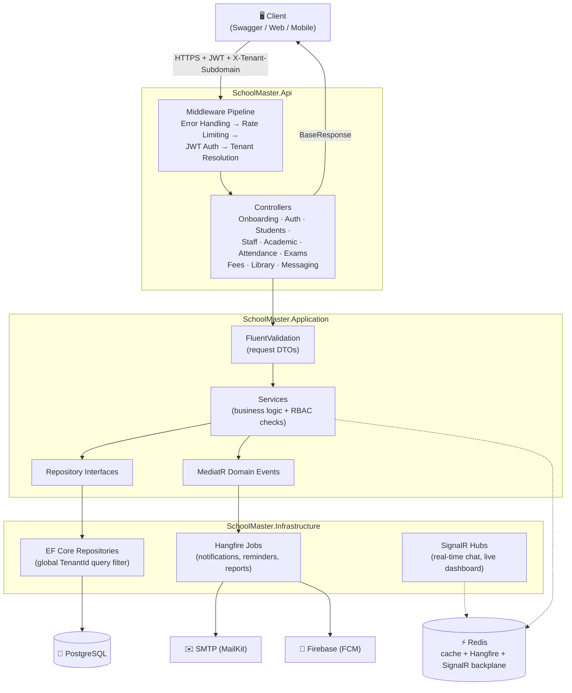

# SchoolMaster

A multi-tenant school management system built with ASP.NET Core 10, N-Tier Architecture, PostgreSQL, Redis, Hangfire, and SignalR. Each school (tenant) is fully isolated — all queries are scoped to a `TenantId` via EF Core global query filters. No cross-tenant data leakage.

---

## 🌐 Live API

| | |
|---|---|
| **Base URL** | `https://schoolmaster-production.up.railway.app` |
| **API Docs (Swagger)** | `https://schoolmaster-production.up.railway.app/swagger` |
| **Health Check** | `https://schoolmaster-production.up.railway.app/health/ready` |

> Tenant-scoped endpoints require a valid JWT **and** the `X-Tenant-Subdomain` header. Start at `POST /api/v1/onboarding/tenants` to register a school, verify the admin email with the OTP, then log in.

---

## Architecture

The application follows an N-Tier architecture (Controller → Service → Repository → Database).



- **Controllers** handle HTTP requests, headers, and routing — no business logic.
- **Services** contain all business logic and RBAC checks.
- **Repositories** abstract EF Core data access — no business logic.
- **Middleware** resolves the tenant from `X-Tenant-Subdomain` before any handler runs, so every downstream query is automatically tenant-scoped.
- **Domain events** decouple side effects (absence emails, payment reminders) from the request/response path.

---

## Getting Started

SchoolMaster is multi-tenant — nothing works until a school exists and its admin is verified. You can follow the whole flow against the [live API](https://schoolmaster-production.up.railway.app/swagger) with no local setup, or run it locally with Docker first.

Two rules that explain most 401/404 responses:

1. Every tenant-scoped request needs **both** `Authorization: Bearer <token>` **and** the `X-Tenant-Subdomain` header.
2. In `Development`, the OTP is always `000000` — no inbox required.

### Happy Path

| # | Step | Endpoint | Auth |
|---|---|---|---|
| 1 | Register school and admin | `POST /api/v1/onboarding/tenants` | Public |
| 2 | Verify admin email with OTP | `POST /api/v1/onboarding/verify-email` | Public |
| 3 | Log in — returns JWT + refresh token | `POST /api/v1/auth/login` | Public |
| 4 | Create an academic year | `POST /api/v1/academic/years` | Admin |
| 5 | Create a term inside that year | `POST /api/v1/academic/terms` | Admin |
| 6 | Create a class and a subject | `POST /api/v1/academic/classes` + `/subjects` | Admin |
| 7 | Invite a teacher (they verify via email) | `POST /api/v1/staff` | Admin |
| 8 | Add a timetable period to the class | `POST /api/v1/academic/classes/{classId}/periods` | Admin |
| 9 | Enroll a student into the class | `POST /api/v1/students` | Admin |
| 10 | Mark attendance for the class | `POST /api/v1/attendance` | Teacher |
| 11 | Read back the student's attendance | `GET /api/v1/attendance/student/{id}` | Admin, Teacher, Parent |

Marking a student **Absent** in step 10 queues a Hangfire job that emails the guardian — the response returns immediately with `notificationsQueued`.

---

## Quick Start

**1. Run with Docker**

```bash
docker compose up --build -d
```

The API will be available at `http://localhost:7001`.

**2. Database Migrations**

```bash
# Create a new migration after changing entities
dotnet ef migrations add <MigrationName>

# Migrations are applied automatically on startup — just rebuild the container
docker compose up --build -d api
```

**3. Run Tests**

```bash
dotnet test
```

**4. Load Tests**

A user lifecycle simulation is configured in `SchoolMaster.LoadTests` using **NBomber**. It seeds 5 unique tenants, simulates concurrent admin and teacher logins, and marks attendance with realistic status distribution.

```bash
dotnet run --project SchoolMaster.LoadTests/SchoolMaster.LoadTests.csproj
```

---

## Phase 1 — Core Foundation

> Weeks 1–4 · Identity & Access, Student Management, Teacher & Staff, Academic Setup, Attendance Tracking

### ✓ Complete

- **Multi-Role Authentication** — JWT + refresh token auth with rotation, BCrypt password hashing, OTP email verification, and password reset flow. Supports Admin, Teacher, Student, Parent, and Staff roles.
- **Role-Based Access Control (RBAC)** — Fine-grained permissions per role (`RolePermissions.cs`). Each endpoint enforces ownership and role boundaries.
- **Rate Limiting** — Fixed window rate limiter on all onboarding and auth endpoints (5 requests/minute per IP).
- **Environment-Specific OTP** — Returns `000000` in `Development`; cryptographically secure 4-digit codes in all other environments.
- **Student Enrollment** — Full admission workflow: personal info, guardian contacts, class assignment, unique student ID generation (`SchoolCode/YEAR/SEQUENCE`), bulk JSON enrollment with partial-success reporting.
- **Teacher & Staff Profiles** — Qualifications, department mapping, unique staff ID generation (`SchoolCode/STF/YEAR/SEQUENCE`), invitation email workflow, bulk staff enrollment.
- **Academic Setup** — Configurable academic years, terms, classes, and subjects with current-status tracking.
- **Weekly Timetable** — Add and manage class periods (Timetabled, DailyRegister, NonAcademic). Automatically rejects overlapping time slots.
- **Daily Attendance Marking** — Per class, supports Present/Absent/Late/Excused with upsert for corrections.
- **Automated Absence Notifications** — Marking absent fires a MediatR domain event → Hangfire job → guardian email, within 5 seconds.
- **Audit Logging** — Every write operation records who, when, and what changed.
- **Soft Delete** — Students and staff are deactivated, not hard-deleted.
- **Timetable Conflict Detection** — Overlapping periods are rejected automatically before saving.
- **Automated Testing** — xUnit + Moq unit tests. WebApplicationFactory + Testcontainers integration tests against real PostgreSQL.
- **CI/CD** — GitHub Actions: build → test → push Docker image → deploy on every push to `develop` and PR to `main`.
- **Docker** — Multi-stage Dockerfile and `docker-compose.yml` with PostgreSQL and Redis.

### 🛣️ Roadmap (Phase 1 Extensions)

- Student and staff directory — list, get, update, withdraw endpoints with pagination and filtering
- Subject assignment — map teachers to the subjects they teach
- Leave requests — staff submit; admins approve or reject
- Attendance analytics — filtered reports, low-attendance alerts, weekly heatmaps
- CSV import/export — multipart CSV upload for bulk enrollment; CSV export for attendance reports
- File uploads — student/staff photos via Azure Blob or S3
- Parent mobile push notifications via Firebase Cloud Messaging

---

### Phase 1 Tech Stack

| Technology | Version | Purpose |
|---|---|---|
| .NET SDK | 10.0 | Runtime & framework |
| ASP.NET Core | 10.0 | Web API (Controllers) |
| Entity Framework Core | 10.0 | ORM / data access |
| Npgsql (EF Core Provider) | 10.0 | PostgreSQL driver |
| PostgreSQL | 16+ | Relational database |
| Redis | 7+ | Distributed cache + Hangfire storage |
| FluentValidation | 11.x | Request validation |
| BCrypt.Net-Next | 4.x | Password hashing |
| MailKit | 4.x | SMTP email (OTP, notifications) |
| Hangfire | 1.8.x | Background jobs |
| Serilog | 3.x | Structured logging |
| JWT Bearer Authentication | 10.0 | Token-based auth |
| OpenAPI / Swagger | 10.0 | API documentation |
| xUnit | 2.x | Unit testing |
| Moq | 4.x | Mocking |
| Testcontainers | 3.x | Real PostgreSQL in integration tests |
| Microsoft.AspNetCore.Mvc.Testing | 10.0 | Integration test host |
| NBomber | — | Load testing |
| Docker | — | Containerization |
| GitHub Actions | — | CI/CD |

---

## Phase 2 — Academic & Financial Core

> Weeks 5–9 · Examinations & Results, Fee & Finance, Library Management, Messaging & Communication, Real-Time Features

### Phase 2 Features

- **Examinations & Results** — Exam scheduling, automated seat and room allocation, mark sheet entry, result computation with totals/averages/class rankings, configurable publication dates, student and parent result portal, performance trend charts per student across terms.
- **Fee & Finance** — Fee structure setup per class, term, and category. Invoice generation per student per term. Payment recording (cash, bank transfer, online). Automated payment reminders via Hangfire email jobs. Outstanding balance tracking with overdue alerts. Fee waivers and scholarship management. Financial reports (monthly, termly, yearly). PDF receipt generation.
- **Library Management** — Book catalogue with ISBN, title, author, and category tracking. Typeahead search using PostgreSQL full-text search. Issue and return workflow with due dates. Automatic fine calculation for overdue returns. Reservation queue when all copies are issued. Borrowing history per student.
- **Messaging & Communication** — 1:1 messaging between teachers, parents, and students. Group announcements scoped to school-wide, class-level, or subject-level. Push notifications via Firebase Cloud Messaging. In-app notification channel. Message read receipts. Admin broadcast to all parents in the tenant.
- **Real-Time via SignalR** — Live attendance dashboard updates pushed to admins as teachers mark attendance. Real-time 1:1 and group chat delivered via SignalR hubs. Redis backplane enables real-time features across multiple API instances.
- **Redis Distributed Caching** — Reference data (class lists, subjects, fee structures) cached with `IMemoryCache` + Redis. Cache invalidated automatically on writes. Session data and real-time counters stored in Redis.

---

### Phase 2 Tech Stack Additions

| Technology | Version | Purpose |
|---|---|---|
| SignalR | 10.0 | Real-time WebSocket connections |
| Firebase Admin SDK | — | FCM push notifications to mobile |
| QuestPDF | — | PDF generation for receipts and reports |
| PostgreSQL Full-Text Search | 16+ | Typeahead search for library catalogue |

---

### Phase 2 API Endpoints

#### Examinations API — `/api/v1/exams`

> 🔒 All endpoints require JWT + `X-Tenant-Subdomain` header.

| Method | Endpoint | Description | Roles |
|---|---|---|---|
| `POST` | `/api/v1/exams` | Schedule an exam | Admin |
| `GET` | `/api/v1/exams` | List exams (paginated, filterable by term/class) | Admin, Teacher |
| `GET` | `/api/v1/exams/{id}` | Get exam details | Admin, Teacher |
| `PATCH` | `/api/v1/exams/{id}` | Update exam | Admin |
| `DELETE` | `/api/v1/exams/{id}` | Cancel exam | Admin |
| `POST` | `/api/v1/exams/{id}/seat-allocation` | Auto-allocate students to seats and rooms | Admin |
| `GET` | `/api/v1/exams/{id}/seat-allocation` | Get seat allocation list | Admin, Teacher |
| `POST` | `/api/v1/exams/{id}/mark-sheets` | Submit mark sheet entries for an exam | Teacher |
| `GET` | `/api/v1/exams/{id}/results` | Get computed results with totals, averages, rankings | Admin, Teacher |
| `POST` | `/api/v1/exams/{id}/publish` | Publish results (immediate or scheduled) | Admin |
| `GET` | `/api/v1/students/{id}/results` | Student result history and performance trend | Admin, Teacher, Parent, Student |

#### Fee & Finance API — `/api/v1/fees`

> 🔒 All endpoints require JWT + `X-Tenant-Subdomain` header.

| Method | Endpoint | Description | Roles |
|---|---|---|---|
| `POST` | `/api/v1/fees/structures` | Create fee structure (per class, term, category) | Admin, Accountant |
| `GET` | `/api/v1/fees/structures` | List fee structures | Admin, Accountant |
| `POST` | `/api/v1/fees/invoices` | Generate invoices for a class or term | Admin, Accountant |
| `GET` | `/api/v1/fees/invoices` | List invoices (filterable by class, term, status) | Admin, Accountant |
| `GET` | `/api/v1/fees/invoices/{id}` | Get invoice details | Admin, Accountant, Parent (own) |
| `POST` | `/api/v1/fees/payments` | Record a payment against an invoice | Admin, Accountant |
| `GET` | `/api/v1/fees/payments` | List payments | Admin, Accountant |
| `POST` | `/api/v1/fees/waivers` | Apply a fee waiver or scholarship | Admin, Accountant |
| `GET` | `/api/v1/fees/outstanding` | List students with outstanding balances | Admin, Accountant |
| `GET` | `/api/v1/fees/reports` | Financial summary report (monthly/termly/yearly) | Admin, Accountant |
| `GET` | `/api/v1/fees/invoices/{id}/receipt` | Download payment receipt as PDF | Admin, Accountant, Parent |

#### Library API — `/api/v1/library`

> 🔒 All endpoints require JWT + `X-Tenant-Subdomain` header.

| Method | Endpoint | Description | Roles |
|---|---|---|---|
| `POST` | `/api/v1/library/books` | Add a book to the catalogue | Admin, Librarian |
| `GET` | `/api/v1/library/books` | Search books (typeahead, paginated) | All |
| `GET` | `/api/v1/library/books/{id}` | Get book details and copy availability | All |
| `PATCH` | `/api/v1/library/books/{id}` | Update book details | Admin, Librarian |
| `POST` | `/api/v1/library/books/{id}/issue` | Issue a copy to a student | Librarian |
| `POST` | `/api/v1/library/books/{id}/return` | Return a copy — calculates fines if overdue | Librarian |
| `POST` | `/api/v1/library/books/{id}/reserve` | Reserve a copy when all are issued | Student, Parent |
| `GET` | `/api/v1/library/borrowings` | Borrowing history (filterable by student) | Admin, Librarian, Teacher |
| `GET` | `/api/v1/library/fines` | List outstanding fines | Admin, Librarian |

#### Messaging API — `/api/v1/messaging`

> 🔒 All endpoints require JWT + `X-Tenant-Subdomain` header.

| Method | Endpoint | Description | Roles |
|---|---|---|---|
| `POST` | `/api/v1/messaging/conversations` | Start a 1:1 conversation | Teacher, Parent, Student |
| `GET` | `/api/v1/messaging/conversations` | List my conversations | All |
| `POST` | `/api/v1/messaging/conversations/{id}/messages` | Send a message | All |
| `GET` | `/api/v1/messaging/conversations/{id}/messages` | Get messages (paginated) | All |
| `PATCH` | `/api/v1/messaging/conversations/{id}/messages/{msgId}/read` | Mark message as read | All |
| `POST` | `/api/v1/messaging/announcements` | Create announcement (school/class/subject) | Admin, Teacher |
| `GET` | `/api/v1/messaging/announcements` | List announcements for the current user | All |

---

### Phase 2 Request & Response Examples

#### Schedule an Exam

```http
POST /api/v1/exams
Content-Type: application/json
Authorization: Bearer <admin-token>
X-Tenant-Subdomain: susie.academy.edu

{
  "title": "First Term Mathematics Exam",
  "classId": "3fa85f64-5717-4562-b3fc-2c963f66afa6",
  "subjectId": "3fa85f64-5717-4562-b3fc-2c963f66afa5",
  "termId": "3fa85f64-5717-4562-b3fc-2c963f66afa4",
  "date": "2026-07-10",
  "startTime": "09:00",
  "durationMinutes": 90,
  "totalMarks": 100,
  "passMarks": 50
}
```

**Response** `201 Created`:

```json
{
  "success": true,
  "message": "Exam scheduled successfully.",
  "data": {
    "id": "3fa85f64-5717-4562-b3fc-2c963f66afb1",
    "title": "First Term Mathematics Exam",
    "className": "JSS 1A",
    "subjectName": "Mathematics",
    "date": "2026-07-10",
    "startTime": "09:00",
    "durationMinutes": 90,
    "totalMarks": 100,
    "status": "Scheduled"
  }
}
```

#### Record a Payment

```http
POST /api/v1/fees/payments
Content-Type: application/json
Authorization: Bearer <accountant-token>
X-Tenant-Subdomain: susie.academy.edu

{
  "invoiceId": "3fa85f64-5717-4562-b3fc-2c963f66afb2",
  "amountPaid": 25000.00,
  "paymentMethod": "BankTransfer",
  "paymentReference": "TRF20260617001",
  "paymentDate": "2026-06-17"
}
```

**Response** `200 OK`:

```json
{
  "success": true,
  "message": "Payment recorded successfully.",
  "data": {
    "paymentId": "3fa85f64-5717-4562-b3fc-2c963f66afb3",
    "invoiceId": "3fa85f64-5717-4562-b3fc-2c963f66afb2",
    "studentName": "Amara Okafor",
    "amountPaid": 25000.00,
    "outstandingBalance": 0.00,
    "status": "Paid",
    "receiptUrl": "/api/v1/fees/invoices/3fa85f64-.../receipt"
  }
}
```

#### Send a Message

```http
POST /api/v1/messaging/conversations/3fa85f64-.../messages
Content-Type: application/json
Authorization: Bearer <teacher-token>
X-Tenant-Subdomain: susie.academy.edu

{
  "content": "Amara was late to class twice this week. Please follow up with her at home."
}
```

**Response** `201 Created`:

```json
{
  "success": true,
  "message": "Message sent.",
  "data": {
    "messageId": "3fa85f64-5717-4562-b3fc-2c963f66afb4",
    "conversationId": "3fa85f64-...",
    "senderId": "3fa85f64-...",
    "senderName": "Mr. Okonkwo",
    "content": "Amara was late to class twice this week. Please follow up with her at home.",
    "sentAt": "2026-07-25T10:30:00Z",
    "readAt": null
  }
}
```

> If the recipient has mobile push notifications enabled, Firebase Cloud Messaging delivers the alert to their device.

---

### Phase 2 Potential Improvements

- [ ] Examinations & Results — scheduling, seat allocation, mark sheets, result computation, publication
- [ ] Fee & Finance — fee structures, invoicing, payments, reminders, waivers, PDF receipts
- [ ] Library Management — book catalogue, typeahead search, issue/return, fines, reservation queue
- [ ] Messaging & Communication — 1:1 chat, group announcements, FCM push notifications, read receipts
- [ ] SignalR — real-time attendance dashboard, live chat, Redis backplane
- [ ] Redis distributed caching — reference data caching with cache invalidation on writes
- [ ] QuestPDF — PDF receipt and report generation
- [ ] Attendance analytics — heatmap view per class per week
- [ ] CSV export — attendance reports and financial summaries

