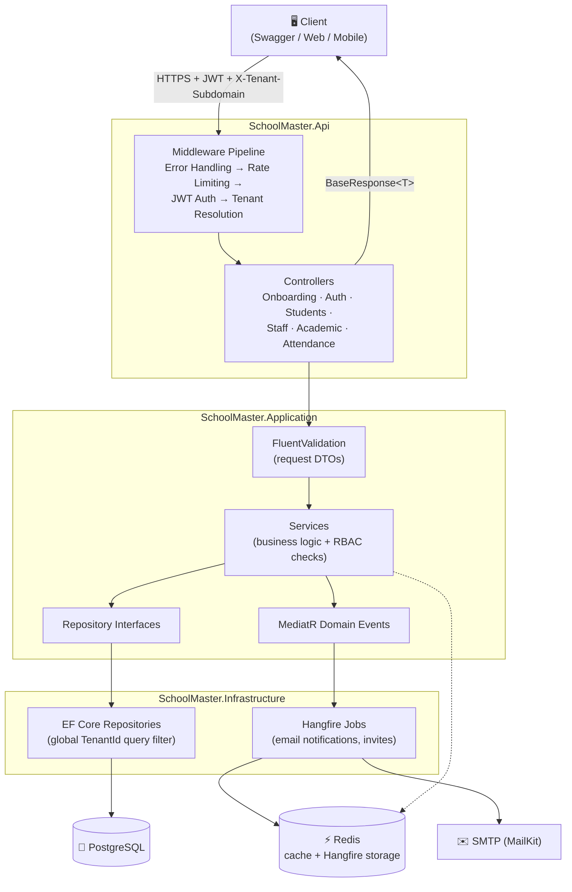

# SchoolMaster
---

## Phase 1 — Core Foundation

> Weeks 1–4 · Clean Architecture scaffold, Identity & Access, Student Management, Teacher & Staff Management, Academic Setup, Attendance Tracking

---

## 🌐 Live API

| | |
|---|---|
| **Base URL** | `https://schoolmaster-production.up.railway.app` |
| **API docs (Swagger)** | <https://schoolmaster-production.up.railway.app/swagger> |
| **Health check** | `https://schoolmaster-production.up.railway.app/health/ready` |

> All endpoint paths below are relative to the base URL. Tenant-scoped endpoints require a valid JWT **and** the `X-Tenant-Subdomain` header. Start at `POST /api/v1/onboarding/tenants` to register a school and its admin, then verify the admin email with the OTP before logging in.

---

### Phase 1 Features

> **What's shipped vs. what's planned**
>
> - **✓ Complete (live in the API today):** authentication & RBAC, school onboarding, student enrollment (including bulk), staff profiles & invitations (including bulk), academic setup (years, terms, classes, subjects), timetable management, and daily attendance with automated absence notifications.
> - **🛣️ Roadmap (not yet implemented):** subject assignment, leave requests, attendance analytics & reporting, CSV import/export, and file/photo uploads.

> Endpoints marked **[Roadmap]** in the tables below are designed but not yet built — they are documented here so the intended API surface is clear. Everything unmarked is implemented and callable against the live base URL.

#### ✓ Complete

- **Multi-Role Authentication** — JWT + refresh token auth with rotation, BCrypt password hashing, OTP email verification, and password reset flow. Supports Admin, Teacher, Student, Parent, and Staff roles.
- **Role-Based Access Control (RBAC)** — Fine-grained permissions per role (`RolePermissions.cs`). Each endpoint enforces ownership and role boundaries. No cross-tenant data leakage.
- **Rate Limiting** — Fixed window rate limiter on all onboarding and authentication endpoints to prevent brute-force attacks (5 requests/minute per IP).
- **Environment-Specific OTP Service** — Returns fixed OTP `000000` in `Development` mode, and generates cryptographically secure 4-digit codes in other environments.
- **Student Enrollment** — Full admission workflow: personal info, guardian contacts, class assignment, unique student ID generation (`SchoolCode/YEAR/SEQUENCE`).
- **Academic Year & Term Setup** — Configurable academic calendar: years, terms, classes, and subjects.
- **Teacher & Staff Profiles** — Qualifications, department mapping, and unique staff ID generation (`SchoolCode/STF/YEAR/SEQUENCE`).
- **Weekly Timetable Setup** — Add and manage weekly class periods (Timetabled, DailyRegister, and NonAcademic). Automatically checks and rejects overlapping time slots.
- **Daily Attendance Marking** — Teachers mark attendance per class. Supports Present, Absent, Late, and Excused statuses (with upsert support for making corrections).
- **Automated Absence Notifications** — Marking a student absent triggers a MediatR domain event that queues a Hangfire background job, sending email notifications to guardians.
- **N-Tier Architecture** — DB → Repository → Service → Controller pattern. All layers communicate through interfaces for a straightforward data flow and clear separation of concerns.
- **Multi-Tenant Design** — Every query is scoped to a `TenantId` via EF Core global query filters. Tenant is resolved from the `X-Tenant-Subdomain` header via middleware.
- **Standardized Responses** — All endpoints return a consistent `BaseResponse<T>` wrapper with `success`, `message`, and `data` fields.
- **Global Error Handling** — Centralized middleware maps domain exceptions to HTTP status codes.
- **Strongly-Typed Configuration** — JWT, email, and tenant settings bound to typed options classes.
- **Input Validation** — FluentValidation on all request DTOs with consistent error response shape.
- **Structured Logging** — Serilog logging to console and local file database.
- **Async Operations** — All database and I/O operations fully asynchronous.
- **Automated Testing** — Unit tests (xUnit + Moq) for all service and command handler logic. Integration tests using `WebApplicationFactory` + Testcontainers (real PostgreSQL).
- **CI/CD** — GitHub Actions: build → test → push Docker image → deploy on every push to `develop` and PR to `main`.
- **Docker Support** — Multi-stage Dockerfile and `docker-compose.yml` with PostgreSQL and Redis side by side.

#### 🛣️ Roadmap

- **Student & Staff Directory** — List, get, update, and withdraw/deactivate endpoints with pagination and filtering.
- **Subject Assignment** — Map teachers to the subjects they teach.
- **Leave Requests** — Staff submit leave requests; admins approve or reject.
- **Attendance Analytics** — Filtered reports, low-attendance alerts, and per-class weekly heatmaps.
- **CSV Import/Export** — Multipart CSV upload for bulk enrollment (the current bulk endpoints take a JSON array) and CSV export for attendance reports.
- **File Uploads** — Student/staff photos backed by Azure Blob or S3.
- **Push Notifications** — Parent mobile push via Firebase Cloud Messaging.

---

### Phase 1 Tech Stack

| Technology | Version | Purpose |
|---|---|---|
| .NET SDK | 10.0 | Runtime & framework |
| ASP.NET Core | 10.0 | Web API (Controllers) |
| Entity Framework Core | 10.0 | ORM / data access |
| Npgsql (EF Core Provider) | 10.0 | PostgreSQL driver |
| PostgreSQL | 16+ | Relational database |
| Redis | 7+ | Distributed cache + SignalR backplane |
| FluentValidation | 11.x | Request validation |
| BCrypt.Net-Next | 4.x | Password hashing |
| MailKit | 4.x | SMTP email (OTP, notifications) |
| Hangfire | 1.8.x | Background jobs (notifications, invites) |
| Serilog | 3.x | Structured logging |
| JWT Bearer Authentication | 10.0 | Token-based auth |
| OpenAPI / Swagger | 10.0 | API documentation |
| xUnit | 2.x | Testing framework |
| Moq | 4.x | Mocking for unit tests |
| Testcontainers | 3.x | Real PostgreSQL in integration tests |
| Microsoft.AspNetCore.Mvc.Testing | 10.0 | Integration test host |
| Docker | — | Containerization |
| GitHub Actions | — | CI/CD pipeline |

---

### Phase 1 Architecture

The application follows an N-Tier architecture (Controller → Service → Repository → Database).



- **Controllers** (Api project) handle HTTP requests, headers, and routing.
- **Services** (Application project) contain all the core business logic.
- **Repositories** (Application/Infrastructure projects) abstract the Entity Framework Core data access and database operations.
- **Middleware** resolves the tenant from `X-Tenant-Subdomain` before any handler runs, so every downstream query is automatically tenant-scoped.
- **Domain events** decouple side effects (e.g. absence emails) from the request/response path — the caller never waits on SMTP.

---

### Phase 1 API Endpoints

#### Onboarding & Verification API

Base URL: `/api/v1/onboarding`

| Method | Endpoint | Description | Auth Required |
|---|---|---|---|
| `POST` | `/api/v1/onboarding/tenants` | Register a new school and create its Admin | ❌ No |
| `POST` | `/api/v1/onboarding/verify-email` | Verify Admin email with OTP | ❌ No |
| `POST` | `/api/v1/onboarding/resend-verification-otp` | Resend OTP email | ❌ No |

#### Account Management API

Base URL: `/api/v1/account`

| Method | Endpoint | Description | Auth Required |
|---|---|---|---|
| `POST` | `/api/v1/account/verify-email` | Verify a logged-in user's email with OTP | ✅ Yes |

#### Authentication API

Base URL: `/api/v1/auth`

| Method | Endpoint | Description | Auth Required |
|---|---|---|---|
| `POST` | `/api/v1/auth/login` | Login — returns JWT + refresh token | ❌ No |
| `POST` | `/api/v1/auth/refresh-token` | Exchange refresh token for new JWT | ❌ No |
| `POST` | `/api/v1/auth/forgot-password` | Request password reset OTP | ❌ No |
| `POST` | `/api/v1/auth/reset-password` | Reset password with OTP | ❌ No |
| `PATCH` | `/api/v1/auth/users/deactivate-by-email` | Deactivate a user account | ✅ Yes (Admin) |

#### Students API

Base URL: `/api/v1/students`

> 🔒 All endpoints require a valid JWT and the `X-Tenant-Subdomain` header. Scoped to the authenticated school tenant.

| Method | Endpoint | Description | Roles |
|---|---|---|---|
| `POST` | `/api/v1/students` | Enroll a new student | Admin |
| `POST` | `/api/v1/students/bulk` | Bulk enroll students (JSON array, partial success) | Admin |
| `GET` | `/api/v1/students` | **[Roadmap]** List all students (paginated, filterable) | Admin, Teacher |
| `GET` | `/api/v1/students/{id}` | **[Roadmap]** Get student profile | Admin, Teacher, Parent (own child) |
| `PUT` | `/api/v1/students/{id}` | **[Roadmap]** Update student profile | Admin |
| `DELETE` | `/api/v1/students/{id}` | **[Roadmap]** Withdraw student | Admin |
| `GET` | `/api/v1/students/{id}/history` | **[Roadmap]** Academic history across years | Admin, Teacher |
| `POST` | `/api/v1/students/{id}/photo` | **[Roadmap]** Upload student photo | Admin |

#### Staff API

Base URL: `/api/v1/staff`

> 🔒 All endpoints require a valid JWT and the `X-Tenant-Subdomain` header. Scoped to the authenticated school tenant.

| Method | Endpoint | Description | Roles |
|---|---|---|---|
| `POST` | `/api/v1/staff` | Create staff profile and send invitation | Admin |
| `POST` | `/api/v1/staff/resend-invitation` | Resend verification email to pending staff | Admin |
| `POST` | `/api/v1/staff/bulk` | Bulk enroll staff (JSON array, partial success) | Admin |
| `GET` | `/api/v1/staff` | **[Roadmap]** List all staff | Admin |
| `GET` | `/api/v1/staff/{id}` | **[Roadmap]** Get staff profile | Admin, Teacher (own) |
| `PUT` | `/api/v1/staff/{id}` | **[Roadmap]** Update staff profile | Admin |
| `POST` | `/api/v1/staff/{id}/assign-subject` | **[Roadmap]** Assign subject to teacher | Admin |
| `POST` | `/api/v1/staff/{id}/leave-request` | **[Roadmap]** Submit a leave request | Teacher, Staff |
| `PUT` | `/api/v1/staff/leave-request/{id}/approve` | **[Roadmap]** Approve or reject leave | Admin |

#### Academic API

Base URL: `/api/v1/academic`

> 🔒 All endpoints require a valid JWT and the `X-Tenant-Subdomain` header. Scoped to the authenticated school tenant.

| Method | Endpoint | Description | Roles |
|---|---|---|---|
| `POST` | `/api/v1/academic/years` | Create academic year | Admin |
| `GET` | `/api/v1/academic/years` | List academic years (paginated) | Admin, Teacher |
| `PATCH` | `/api/v1/academic/years/{yearId}` | Partially update an academic year (date/current status) | Admin |
| `POST` | `/api/v1/academic/terms` | Create term within an academic year | Admin |
| `GET` | `/api/v1/academic/years/{yearId}/terms` | Get terms within an academic year | Admin, Teacher |
| `PATCH` | `/api/v1/academic/terms/{termId}` | Partially update a term | Admin |
| `POST` | `/api/v1/academic/classes` | Create a class | Admin |
| `GET` | `/api/v1/academic/classes` | List classes (paginated) | Admin, Teacher |
| `PATCH` | `/api/v1/academic/classes/{classId}` | Partially update a class (assign form teacher) | Admin |
| `POST` | `/api/v1/academic/subjects` | Create a subject | Admin |
| `GET` | `/api/v1/academic/subjects` | List subjects (paginated) | Admin, Teacher |
| `PATCH` | `/api/v1/academic/subjects/{subjectId}` | Partially update a subject | Admin |
| `POST` | `/api/v1/academic/classes/{classId}/periods` | Add a period to a class timetable | Admin |
| `GET` | `/api/v1/academic/classes/{classId}/timetable` | Get class timetable | Admin, Teacher, Student |
| `PATCH` | `/api/v1/academic/classes/{classId}/periods/{periodId}` | Partially update a period (time slot, subject, teacher) | Admin |

#### Attendance API

Base URL: `/api/v1/attendance`

> 🔒 All endpoints require a valid JWT and the `X-Tenant-Subdomain` header. Scoped to the authenticated school tenant.

| Method | Endpoint | Description | Roles |
|---|---|---|---|
| `POST` | `/api/v1/attendance` | Mark attendance for a class (upsert; queues email if absent) | Teacher |
| `GET` | `/api/v1/attendance/student/{id}` | Get student attendance summary and logs | Admin, Teacher, Parent |
| `GET` | `/api/v1/attendance/class/{id}` | Get class attendance for a date | Admin, Teacher |
| `POST` | `/api/v1/attendance/bulk` | **[Roadmap]** Bulk mark entire class | Teacher |
| `GET` | `/api/v1/attendance/report` | **[Roadmap]** Filtered attendance report | Admin |
| `GET` | `/api/v1/attendance/alerts` | **[Roadmap]** Students below threshold | Admin, Teacher |

---

### Phase 1 Request & Response Examples

#### Enroll a Student

```http
POST /api/v1/students
Content-Type: application/json
Authorization: Bearer <admin-token>
X-Tenant-Subdomain: susie.academy.edu

{
  "firstName": "Amara",
  "lastName": "Okafor",
  "email": "amara.okafor@example.com",
  "password": "SecurePassword123!",
  "dateOfBirth": "2012-03-15",
  "gender": "Female",
  "guardianName": "Chukwuemeka Okafor",
  "guardianPhone": "+2348012345678",
  "guardianEmail": "c.okafor@example.com",
  "medicalNotes": "Mild asthma — has inhaler",
  "photoUrl": null,
  "classId": "3fa85f64-5717-4562-b3fc-2c963f66afa6"
}
```

**Response** `200 OK`:

```json
{
  "success": true,
  "message": "Student enrolled successfully.",
  "data": {
    "id": "3fa85f64-5717-4562-b3fc-2c963f66afa7",
    "tenantId": "3fa85f64-5717-4562-b3fc-2c963f66afa0",
    "firstName": "Amara",
    "lastName": "Okafor",
    "studentNumber": "SUS/2026/000001",
    "dateOfBirth": "2012-03-15",
    "gender": "Female",
    "guardianName": "Chukwuemeka Okafor",
    "guardianPhone": "+2348012345678",
    "guardianEmail": "c.okafor@example.com",
    "photoUrl": null
  }
}
```

#### Mark Class Attendance

```http
POST /api/v1/attendance
Content-Type: application/json
Authorization: Bearer <teacher-token>
X-Tenant-Subdomain: susie.academy.edu

{
  "classId": "3fa85f64-5717-4562-b3fc-2c963f66afa6",
  "date": "2026-06-17",
  "records": [
    { "studentId": "3fa85f64-5717-4562-b3fc-2c963f66afa7", "status": "Present", "notes": null },
    { "studentId": "3fa85f64-5717-4562-b3fc-2c963f66afa8", "status": "Absent", "notes": "No call from guardian" }
  ]
}
```

**Response** `200 OK`:

```json
{
  "success": true,
  "message": "Attendance marked successfully.",
  "data": {
    "totalMarked": 2,
    "present": 1,
    "absent": 1,
    "late": 0,
    "excused": 0,
    "notificationsQueued": 1
  }
}
```

> Absence notification is sent to the parent of the absent student within 5 seconds via Hangfire background job.

#### **[Roadmap]** Proposed Bulk Import Students (CSV)

> ℹ️ Bulk enrollment **is already implemented** at `POST /api/v1/students/bulk` and `POST /api/v1/staff/bulk` — those endpoints accept a **JSON array** and return partial-success results. The CSV/multipart variant below is the planned upload-a-spreadsheet flow and is not yet built.

```http
POST /api/v1/students/bulk-import
Content-Type: multipart/form-data
Authorization: Bearer <admin-token>

file: students.csv
classId: 3fa85f64-5717-4562-b3fc-2c963f66afa6
```

**Response** `200 OK`:

```json
{
  "success": true,
  "message": "Bulk import completed",
  "data": {
    "totalRows": 45,
    "successful": 43,
    "failed": 2,
    "failures": [
      { "row": 12, "reason": "Guardian email is invalid" },
      { "row": 31, "reason": "Date of birth is required" }
    ]
  }
}
```

---

### Phase 1 Configuration

| Setting | Location | Description |
|---|---|---|
| Connection string | `appsettings.json` / `.env` → `ConnectionStrings.DefaultConnection` | PostgreSQL connection |
| Redis | `appsettings.json` / `.env` → `ConnectionStrings.Redis` | Cache + Hangfire storage |
| JWT secret | `appsettings.json` / `.env` → `Jwt.Key` | Min 32 characters |
| JWT expiry | `appsettings.json` / `.env` → `Jwt.ExpirationInMinutes` | Default: 60 |
| Refresh token expiry | `appsettings.json` / `.env` → `Jwt.RefreshTokenExpirationInDays` | Default: 30 |
| SMTP server | `appsettings.json` / `.env` → `EmailSettings.SmtpServer` | e.g. smtp.gmail.com |
| OTP expiry | `appsettings.json` / `.env` → `EmailVerification.ExpirationInMinutes` | Default: 15 |
| Blob storage | **[Roadmap]** | Azure Blob or S3 |
| Attendance threshold | **[Roadmap]** | Default: 75 |

---

### Getting Started

**First time here? Start with this.**

SchoolMaster is multi-tenant, so nothing works until a school exists and its admin is verified. You can follow the whole flow against the [live API](https://schoolmaster-production.up.railway.app/swagger) — no local setup needed — or spin it up locally first with the [Quick Start](#quick-start-docker-migrations--testing) below.

Two rules that explain most 401/404 responses:

1. Every tenant-scoped request needs **both** the `Authorization: Bearer <token>` header **and** the `X-Tenant-Subdomain` header.
2. In `Development`, the OTP is always `000000` — no inbox required.

#### The happy path

| # | Step | Call | Who |
|---|---|---|---|
| 1 | Register the school and its admin | `POST /api/v1/onboarding/tenants` | Public |
| 2 | Verify the admin email with the OTP | `POST /api/v1/onboarding/verify-email` | Public |
| 3 | Log in — returns JWT + refresh token | `POST /api/v1/auth/login` | Public |
| 4 | Create an academic year | `POST /api/v1/academic/years` | Admin |
| 5 | Create a term inside that year | `POST /api/v1/academic/terms` | Admin |
| 6 | Create a class and a subject | `POST /api/v1/academic/classes`, `POST /api/v1/academic/subjects` | Admin |
| 7 | Invite a teacher (they verify via email) | `POST /api/v1/staff` | Admin |
| 8 | Add a timetable period to the class | `POST /api/v1/academic/classes/{classId}/periods` | Admin |
| 9 | Enroll a student into the class | `POST /api/v1/students` | Admin |
| 10 | Mark attendance for the class | `POST /api/v1/attendance` | Teacher |
| 11 | Read back the student's attendance | `GET /api/v1/attendance/student/{id}` | Admin, Teacher, Parent |

Marking a student **Absent** in step 10 queues a Hangfire job that emails the guardian — the response returns immediately with `notificationsQueued`.

See [Request & Response Examples](#phase-1-request--response-examples) for full payloads on steps 9 and 10.

---

### Quick Start (Docker, Migrations & Testing)

**1. Run the application with Docker**
The application is fully dockerized with a PostgreSQL database and Redis cache. To start everything:

```bash
docker compose up --build -d
```

*The API will be available at `http://localhost:7001`.*

**2. Database Migrations**
To create a new EF Core migration after changing your entities:

```bash
dotnet ef migrations add <MigrationName>
```

To apply the migrations, simply rebuild and restart the API container (the application automatically applies pending migrations on startup):

```bash
docker compose up --build -d api
```

**3. Running Tests**
The repository includes a comprehensive test suite (xUnit + Moq) covering unit tests and database-isolated integration tests (using Microsoft's `WebApplicationFactory` and real PostgreSQL inside `Testcontainers`):

```bash
dotnet test
```

---

### Advanced

#### Load Testing

A user lifecycle simulation load test is configured in `SchoolMaster.LoadTests` using **NBomber**.
The load test scenario automatically:

- Seeds 5 unique school tenants (with classrooms, subjects, teachers, and students).
- Automates verification codes (bypassed with the `"000000"` dev OTP token).
- Simulates concurrent logins (Admin & Teacher) and marks daily student attendance with dynamic status distribution (Present, Absent, Late, Excused).

To execute the load tests against a running instance of the API (`http://localhost:7001`):

```bash
dotnet run --project SchoolMaster.LoadTests/SchoolMaster.LoadTests.csproj
```

---

### Phase 1 Potential Improvements

- [x] JWT + refresh token auth with rotation
- [x] OTP email verification and password reset
- [x] Multi-tenant architecture with TenantId query filter
- [x] RBAC with fine-grained role permissions
- [x] N-Tier Architecture (DB → Repo → Service → Controller)
- [x] Global error handling middleware
- [x] FluentValidation on all request DTOs
- [x] Hangfire background jobs for notifications
- [x] Attendance domain events → notification pipeline
- [x] Unit and integration tests with Testcontainers
- [x] Docker + docker-compose with PostgreSQL and Redis
- [x] GitHub Actions CI/CD
- [x] Audit log — queryable history of all write operations
- [x] Timetable conflict detection — automatic validation before saving
- [ ] Attendance analytics — heatmap view per class per week
- [ ] Parent mobile push notifications via FCM (Firebase)
- [ ] CSV export for all attendance reports
- [x] Soft delete — deactivate students/staff instead of hard delete
- [x] API versioning — /api/v1/ prefix enforced from day one
- [x] Bulk Enrollment of Students/Staff
